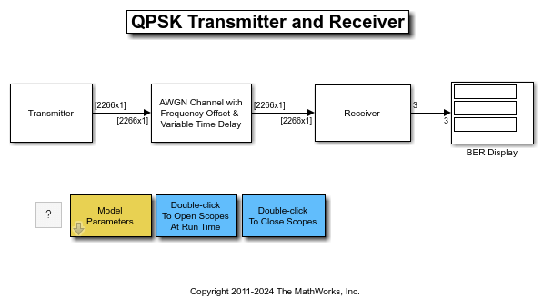

# Workshop: Modelling Communications Systems in Simulink

This workshop is created so that participants can learn how to model communications systems in Simulink. It is based off [QPSK Transmitter and Receiver in Simulink](https://www.mathworks.com/help/releases/R2025b/comm/ug/qpsk-transmitter-and-receiver-in-simulink.html?searchPort=55818).





The topics that will be covered are:

-  Using appropriate solver settings for communication system simulation 
-  Modelling transmitter with bit generation 
-  Modelling channel with frequency, phase, random delay, and noise impairments 
-  Modelling practical receiver to compensate for impaired channels 
-  Using callbacks in Simulink 

To use this material, follow the guide

```matlab
open QPSKTransmitterAndReceiverSimulinkWorkshop.mlx
```
